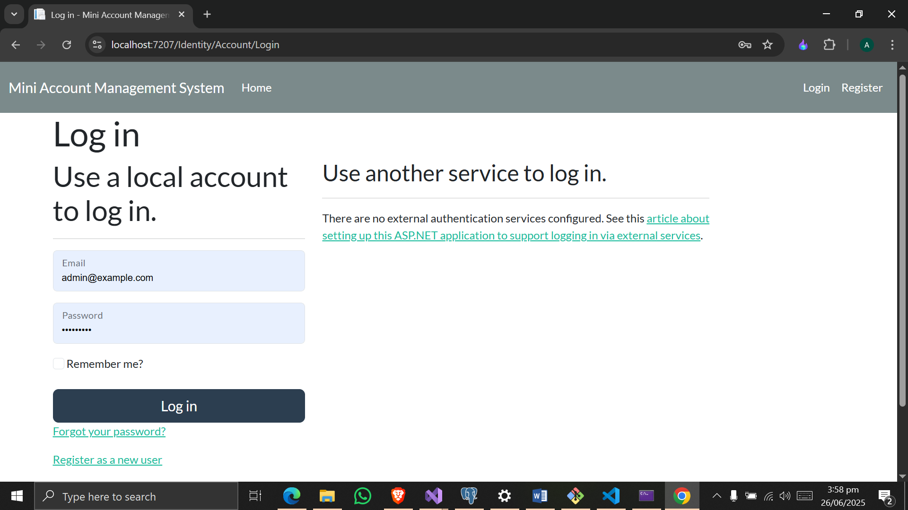
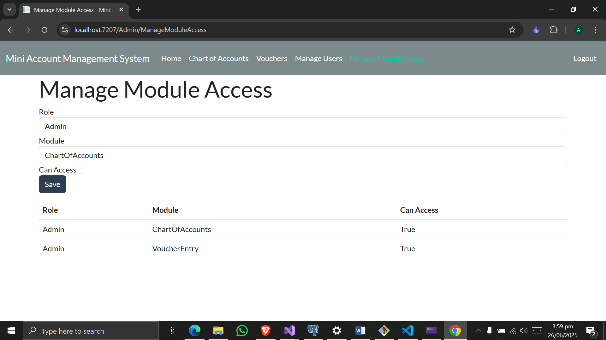

Mini Account Management System

Overview

A web-based account management system built with ASP.NET Core Razor Pages, MS SQL Server (using stored procedures), and ASP.NET Identity for authentication and authorization. Features include user role management, chart of accounts, voucher entry, and Excel report export.

Setup Instructions

Clone the repository: git clone https://github.com/antu41/MiniAccountManagementSystem

Set up SQL Server database (see Database Setup below).

Run the application: open the solution in Visual Studio.

Database Setup

Create a database named testdb in SQL Server.

Execute the provided SQL scripts (database.sql and stored_procedures.sql) to create tables and stored procedures or use the testdb.bak file to restore database.

Update appsettings.json with your connection string.

Run migrations: Run update-database command in Package Manager Console.

Note: Roles (Admin, Accountant, Viewer) and an admin user (admin@example.com, password: Admin@123) are automatically seeded on application startup.

Features

User Roles & Permissions: Manage users and roles (Admin, Accountant, Viewer) with module access rights.

Chart of Accounts: The Chart of Accounts feature allows users to create, update, and delete accounts organized in a hierarchical tree structure. Each account can have a single parent and multiple child accounts, enabling clear categorization. When a parent account is deleted, all of its child accounts are also removed automatically to maintain data integrity. To prevent circular references, the system enforces a rule where a child account cannot be set as the parent of its own parent, ensuring a valid and logical account hierarchy at all times.

Voucher Entry: Support for Journal, Payment, and Receipt vouchers with multi-line debit/credit entries.

Excel Export: Export voucher reports to Excel.

Screenshots

Login Page

Manage Users

Manage Module Access

Chart of Accounts

Voucher Entry

Voucher List

Technologies

ASP.NET Core 8.0 with Razor Pages

MS SQL Server (Stored Procedures)

ASP.NET Identity with Custom Roles

Dapper for data access

EPPluse for Excel export

Bootstrap for styling